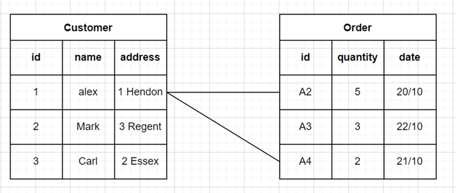
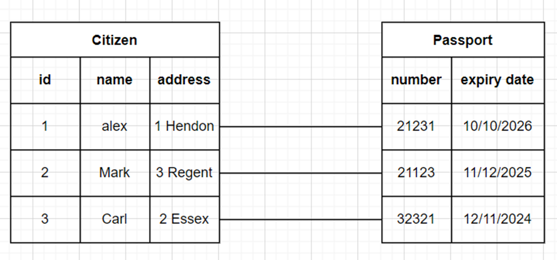
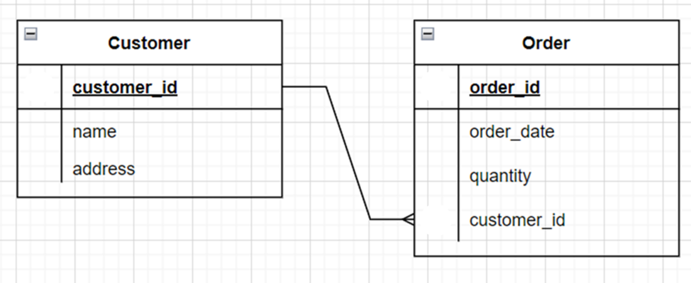

# Knowledge-check: Database relations and keys

1. Identify the relationship between the following two tables (customer and order)

    

    - One-to-Many relationship
    - Many-to-Many relationship
    ```
    Answer: One-to-Many relationship
    Explanation: This is a one-to-many relationship, where each customer can place many orders.
    ```

2. The following tables contain data about citizens and passports. Each citizen is permitted to own one passport. Identify the relationship between the two tables.

    

    - One-to-One relationship
    - Many-to-Many relationship
    ```
    Answer: One-to-One relationship
    Explanation: This is a one-to-one relationship, where each single passport belongs to one citizen only.
    ```

3. The following ER diagram presents a many-to-many relationship between the actor entity and the movie entity.

    

    - True
    - False
    ```
    Answer: True
    Explanation: This diagram is an example of a many-to-many relationship. Each actor can play a role in multiple movies, and each movie can star multiple actors.
    ```

4. The Customer ID in the Order table is a foreign key used to reference the primary key (customer ID) in the Customer table.

    

    - True
    - False
    ```
    Answer: True
    Explanation: The Customer ID in the Order table is a foreign key used to reference the Customer ID primary key in the Customer table.
    ```

5. The entity relationship model is based on two key concepts: Entities and relationships
    - True
    - False
    ```
    Answer: True
    Explanation: Entities defined as tables, and relationships defined as the associations between entities, are the two key concepts of the entity relationship model.
    ```