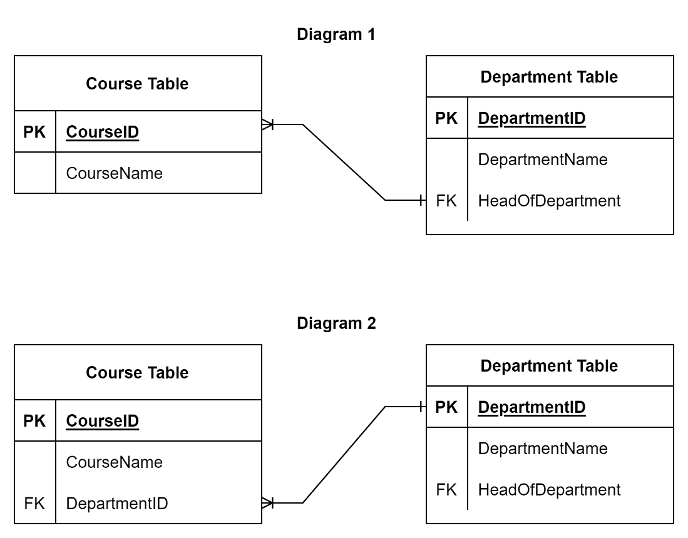

# Self-review: Database schema examples

__NOTE: All questions in this quiz relate to the following table of data.__


1. The table of data conforms with the first normal form.
    - True
    - False
    ```
    Answer: False
    Explanation: This table contains unnecessary repeating groups of data as shown in the department ID, name and head of department columns.
    ```

2. What steps can you take to make sure that the table complies with the first normal form? Select all that apply.
    - Decompose the table to avoid data redundancy.
    - Assign a primary key to the table.
    - Assign a foreign key to the table.
    ```
    Answer: Decompose the table to avoid data redundancy.
            Assign a primary key to the table.
    Explanation: Decomposing the table removes any unnecessary duplication of data.
                 A primary key is required to ensure that the table contains unique records of data.
    ```

3. Assume that the table has been decomposed into two separate tables: `“Departments”` and `“Courses”`. Which attributes should be included in each of the new tables? Remember that the records of the two tables must be linked with a foreign key.
    - The `“Departments”` table should include the department ID, name, and head of department. The `“Courses”` table should include the course ID and course name.
    - The `“Departments”` table should include the department ID, name, and head of department. The `“Courses”` table should include the course ID, course name and department ID.
    ```
    Answer: The “Departments” table should include the department ID, name, and head of department. The “Courses” table should include the course ID, course name and department ID.
    Explanation: The “Courses” table should include the department ID as a foreign key to link the two tables.
    ```

4. After the normalization process is completed and the `“College”` table is decomposed into two tables called `“Departments”` and `“Courses”`. Which of the following two diagrams represents the correct schema?

    

    - Diagram 2.
    - Diagram 1.
    ```
    Answer: Diagram 2.
    Explanation: The Courses table is the child table. It includes the department ID as a foreign key, which connects the two tables.
    ```

5. Which of the following SQL statements can be used to create the Courses table in the new schema? Remember that the Courses table must be linked to the Departments table.
    -   ```sql
        CREATE TABLE Courses (CouseID VARCHAR(5), CourseName VARCHAR(50), DepartmentID VARCHAR(10), PRIMARY KEY (CouseID), FOREIGN KEY (DepartmentID) REFERENCES Courses (DepartmentID))
        ```
    
    -   ```sql
        CREATE TABLE Courses (CouseID VARCHAR(5), CourseName VARCHAR(50), DepartmentID VARCHAR(10), PRIMARY KEY (CouseID), FOREIGN KEY (DepartmentID) REFERENCES Departments (DepartmentID))
        ```
    ```
    Answer: CREATE TABLE Courses (CouseID VARCHAR(5), CourseName VARCHAR(50), DepartmentID VARCHAR(10), PRIMARY KEY (CouseID), FOREIGN KEY (DepartmentID) REFERENCES Departments (DepartmentID))
    Explanation: This is the right SQL syntax.
    ```
