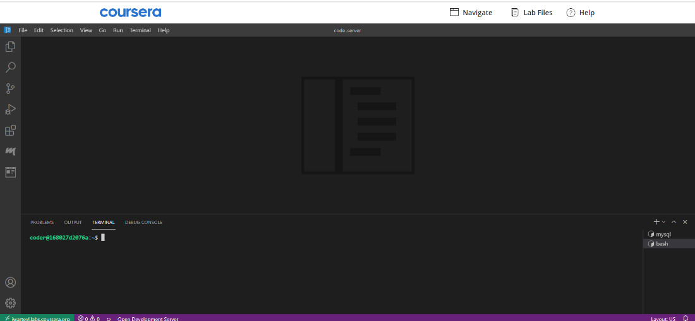
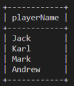
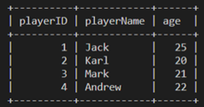
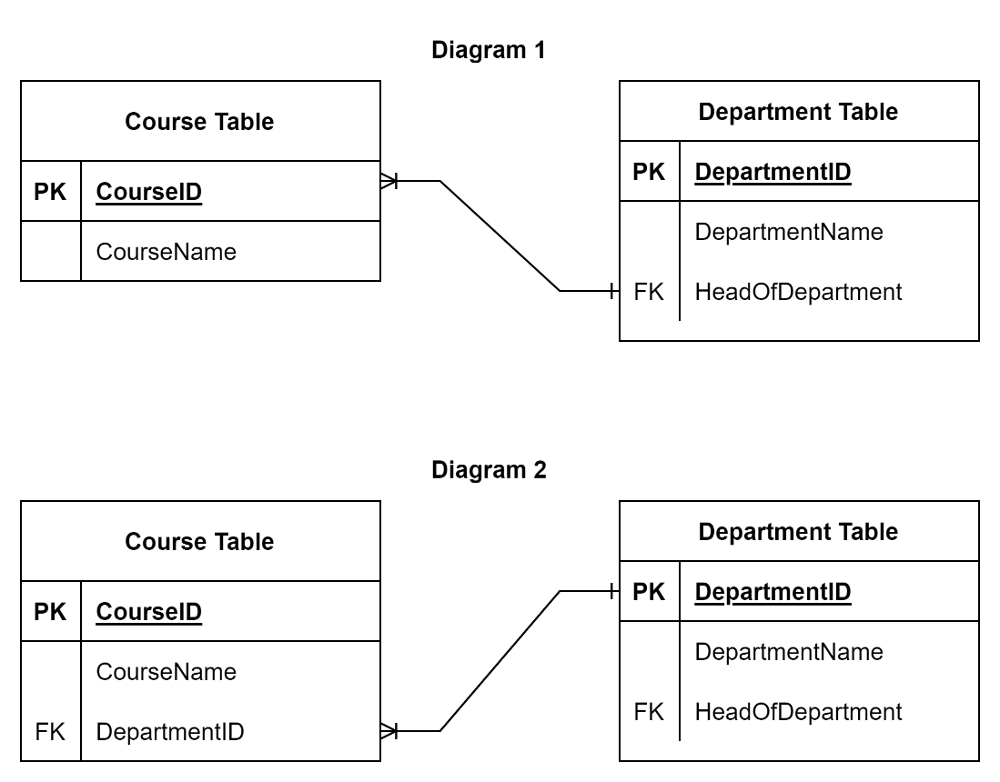

# Graded Assessment: Intro to databases

__This assessment consists of two parts: Code block and a quiz.__

## Part 1 – Code Blocks

To complete this part of the assessment, you can use MySQL database management system available on the Coursera platform.

### Instructions

The questions in this assessment relate to a sports club that needs to build a digital database to maintain data about the players joining the club. 

Run each complete SQL statement you write in this part to develop the database for the sports club.

### Important

Remember to end each complete SQL statement with a semicolon. 

Make sure you leave a space between the SQL terms and the operators. 

For example, a correctly formatted SQL statement must be written as follows:
-   ```sql
    SELECT 5 + 7;
    ```

Here is an example of an incorrectly formatted SQL statement in which there is no semicolon, and no spaces are placed before or after the operator:
-   ```sql
    SELECT 5 + 7
    ```



1. Write an SQL statement to create a database called `"SportsClub"`.
    ```
    Answer: CREATE DATABASE SportsClub;
    Explanation: This is the right syntax to create the sports club database.
    ```

2. In the text field below, input the missing keyword (___) from the following SQL statement to create a table called `"Players"`.
    ```sql
    CREATE ____ Players (playerID INT, playerName VARCHAR(50), age INT, PRIMARY KEY(playerID));
    ```
    Run the complete SQL statement in MySQL to create the table in the club database.
    ```
    Answer: TABLE
    Explanation: TABLE is the missing keyword to create the ‘Players’ table.
    ```

3. In the text field below, input the missing keyword (___) from the following SQL statement to insert data into the `"Players"` table.
    ```sql
    INSERT INTO Players (playerID, playerName, age) ____ (1, "Jack", 25);
    ```
    Run the complete SQL statement in MySQL to insert the record of data in the players table.
    ```
    Answer: VALUES
    Explanation: VALUES is the missing keyword to insert data into the “Players” table.
    ```

4. Insert three more records into the "Players" table that contain the following data:
    - (2, "Karl", 20)
    - (3, "Mark", 21)
    - (4, "Andrew", 22)

    Once you have executed the INSERT INTO statement to enter these three records of data, run the following SQL statement:
    ```sql
    SELECT playerName 
    FROM Players 
    WHERE playerID = 2;
    ```
    What is the playerName that appears on the screen?
    ```
    Answer: Karl
    Explanation: Karl is the player's name with ID number 2.
    ```

5. Write a SQL statement that outputs all players names in the `"Players"` table. When you run the right SQL query, you should have the following output result:

    

    ```
    Answer: SELECT playerName FROM Players;
    Explanation: This is the right syntax to output all players names existing in the “Players” table.
    ```

6. The following table called `"Players"`, contains four records of data. Write a SQL statement that updates the age of the player with `ID = 3`. The new age value should be `'22'`.

    

    ```
    Answer: UPDATE Players SET age = 22 WHERE playerID = 3;
    Explanation: This is the right syntax to update the age of the player with ID = 3.
    ```

7. The following table called "Players", contains four records of data. Write a SQL statement that deletes the record of the player with ID = 4.

    

    ```
    Answer: DELETE FROM Players WHERE playerID = 4;
    Explanation: This is the right syntax to delete the player with ID = 4;
    ```

8. Write an SQL statement that evaluates if the `PlayerID` in the following `"Players"` table is odd or even.
    __Hint:__ Assume X is a number. If the remainder of X divided by 2 is 0, then X is an even number otherwise X is an odd number. Remember to use the `“%”` symbol to get the remainder.

    | PlayerID | Name |
    |----------|------|
    | 1        | Karl |
    | 2        | Adam |
    | 3        | Anas |

    ```
    Answer: SELECT PlayerID % 2 FROM Players;
    Explanation: This is the right syntax to evaluate whether the PlayerID is even or odd in this table.
    ```

9. Write an SQL statement that outputs all names of the players in the following `"Players"` table who are older than `25` years of age.

    | Age | Name |
    |-----|------|
    | 38  | Karl |
    | 25  | Adam |
    | 22  | Anas |

    ```
    Answer: SELECT Name FROM Players WHERE Age > 25;
    Explanation: This is the right syntax to output all names of players that are older than 25 years.
    ```

10. Review the following ER-Diagram. Write the missing part of the SQL statement to define a foreign key that links the course table with the department table.

    

    ```sql
    CREATE TABLE Course( 
    courseID int NOT NULL, courseName VARCHAR(50), PRIMARY KEY (courseID), 
    ____ ____(____) ____ ____ (____) 
    );
    ```
    __Hint:__ write only the missing part in your answer.
    ```
    Answer: FOREIGN KEY(departmentID) REFERENCES Department (departmentID)
    Explanation: 
    ```

## Part 2 – Quiz

11. What is a row of information about one specific staff member in a college database table referred to as?
    - A column
    - A record
    - A key
    ```
    Answer: A record
    Explanation: Each row of the table will have a record of information that refers to a specific staff.
    ```

12. A sports club database includes a table called "Members" with two columns:
    > A `'member number'` column that contains the phone number of each member

    > And a `'full name'` column that contains the full name of each member.
    
    Choose the right data type for each column. Select all correct answers.
    - The `Player` number column data type is `INT`.
    - The `Full name` column data type is `CHAR`.
    - The `Player` number column data type is `DECIMAL`.
    - The `Full name` column data type is `VARCHAR`.
    ```
    Answer: The Player number column data type is INT.
            The Full name column data type is VARCHAR.
    Explanation: INT is the right data type for member number. 
                 VARCHAR is the right data type for the full name.
    ```

13. In a football club the skill level of all new players must automatically be set at the default of level `1`. Which SQL syntax is used to set this default level using the `DEFAULT` keyword?
    -   ```sql
        level INT DEFAULT 1;
        ```
    -   ```sql
        DEFAULT level INT 1;
        ```
    ```
    Answer: level INT DEFAULT 1;
    Explanation: This is the right SQL syntax to set the players DEFAULT level to 1.
    ```

14. Database constraints are used to limit the type of data value that can be stored in a table.
    - True
    - False
    ```
    Answer: True
    Explanation: The constraints ensure the accuracy and reliability of the data value that goes into the table.
    ```

15. The output result of the following SQL statement is the data of all customers from Italy.
    ```sql
    SELECT * 
    FROM customers 
    WHERE Country = "Italy";
    ```
    - True
    - False
    ```
    Answer: True
    Explanation: The output result of this statement returns the data of all customers from Italy. The ‘*’ symbol means all columns in the table.
    ```

16. The output result of the following SQL statement returns the records of all customers from India in Alphabetical order from A to Z.
    ```sql
    SELECT * 
    FROM students 
    WHERE country = "India" 
    ORDER BY FirstName DESC;
    ```
    - True
    - False
    ```
    Answer: False
    Explanation: The output result of this SQL statement returns the records of all customers from India in reverse Alphabetical order from Z to A. This is because the DESC keyword sorts the records in a descending order.
    ```

17. What does the following SQL statement do?
    ```sql
    SELECT * 
    FROM Players 
    ORDER BY Country, PlayerName;
    ```
    - It orders the result by country and ignores the staff name. 
    - It displays the results ordered by country first, then players name.
    ```
    Answer: It displays the results ordered by country first, then players name.
    Explanation: It orders the result set by country first, but if some records have the same country name, it orders them by staff name.
    ```

18. The following table of data conforms with the first normal form.
    | Department ID | Department Name | Head of department | Course ID | Course Name |
    |---------------|-----------------|--------------------|-----------|-------------|
    | D1            | Computing       | Dr Karl            | C1        | Database    |
    | D1            | Computing       | Dr Karl            | C2        | Python      |
    | D1            | Computing       | Dr Karl            | C3        | Web         |
    | D1            | Computing       | Dr Karl            | C4        | Java        |
    | D2            | Math            | Dr Mosa            | C5        | Math        |
    - True
    - False
    ```
    Answer: False
    Explanation: This table contains unnecessary repeating groups of data in the department ID, department name and head of department columns. These columns violate the rule of first normal form.
    ```

19. Which of the following represents the correct diagram that links the course table with the department table?

    

    - Diagram 2
    - Diagram 1
    ```
    Answer: Diagram 1
    Explanation: The courses table is the child table that includes the department ID as a foreign key that connects the two tables.
    ```

20. Identify the relationship between the tables in the diagram. 

    

    - Many to many relationship.
    - One to one relationship.
    - Many to one relationship. 
    ```
    Answer: Many to one relationship.
    Explanation: These diagrams show an example of a many-to-one relationship as many courses may belong to one department.
    ```